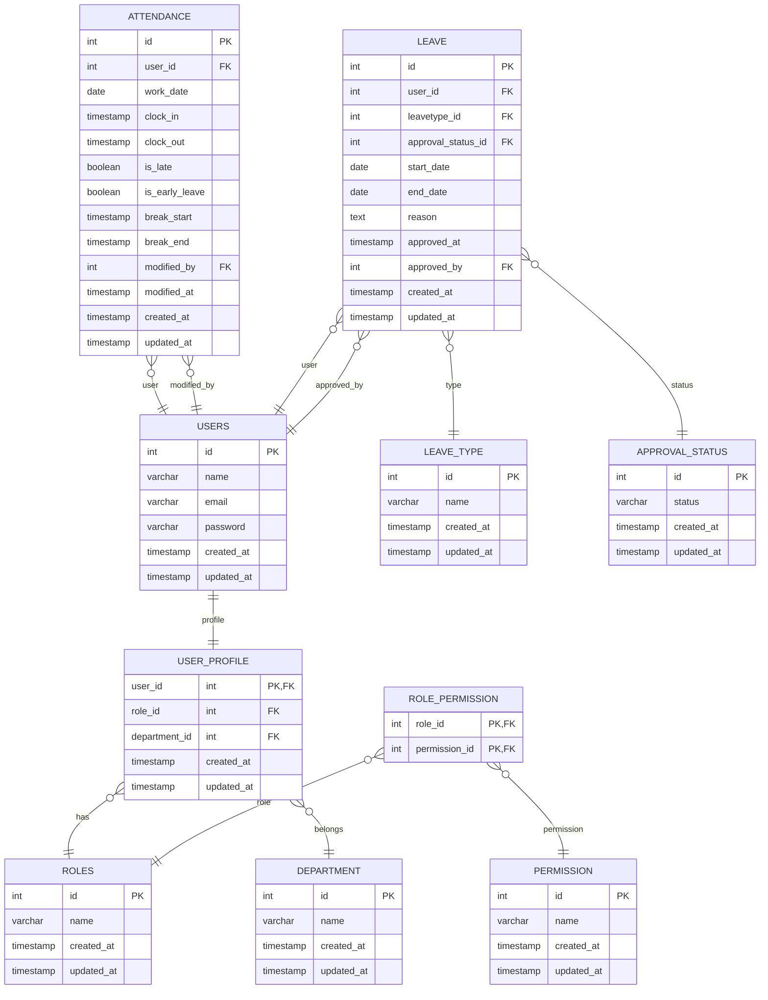
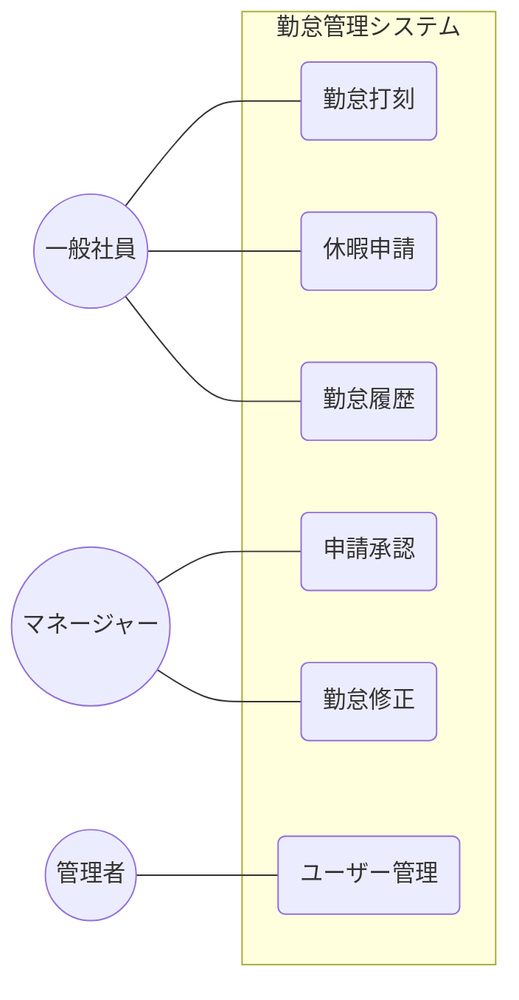

```

```

## 勤怠管理サービス

### 勤怠管理サービスとは

勤怠管理サービスは、従業員の出勤・退勤時間や休暇の管理を効率化するためのシステムです。
これにより、企業は労働時間の正確な把握や給与計算の自動化が可能になります。(スタンドアローン)

### 勤怠管理サービスの主な機能

1. **出勤・退勤の記録**: 従業員がスマートフォンやPCを使用して出勤・退勤時間を記録できます。
2. **休暇管理**: 従業員が休暇の申請や承認をオンラインで行える機能です。
3. **勤怠履歴**: 従業員が自身の勤怠記録を一覧で確認できる機能です。

### 勤怠管理サービスのメリット

- **効率化**: 手動での勤怠管理が不要になり、時間と労力を節約できます。
- **正確性**: 人為的なミスを減らし、正確な勤怠データを提供します。
- **法令遵守**: 労働基準法などの法令に準拠した勤怠管理が可能になります。

### 勤怠管理サービスの選び方

1. **機能の充実度**: 自社のニーズに合った機能があるか確認しましょう。
2. **使いやすさ**: 従業員が簡単に操作できるインターフェースを持つサービスを選びましょう。
3. **サポート体制**: トラブルが発生した際に迅速に対応できるサポート体制が整っているか確認しましょう。

### 機能要件

- **ログイン機能**: 従業員が自分のアカウントでログインできる機能。
- **サインアップ機能**: 新規ユーザーがアカウントを作成できる機能。
- **権限管理**: 管理者とマネージャーと従業員の権限を適切に設定できる機能。
- **ユーザー管理**: 従業員の情報を管理する機能。
- **勤怠記録**: 出勤・退勤・遅刻・早退・休憩開始・休憩終了の時間を記録する機能。

### DB設計

- **ユーザーテーブル**: ユーザーID(主キー)、名前、メールアドレス、パスワード
- **ユーザープロフィールテーブル**: ユーザーID(主キー/外部キー)、役割ID(外部キー)、部署ID(外部キー)
- **勤怠テーブル**: 勤怠ID、ユーザーID、出勤時間、退勤時間、遅刻フラグ、早退フラグ、休憩開始時間、休憩終了時間
- **休暇テーブル**: 休暇ID、ユーザーID、休暇の種類、開始日、終了日、申請理由、承認状況、承認日時、承認者

marmeid



#### テーブル設計書

##### **Usersテーブル**


| 項番 | PK | UK | FK             | カラム名      | 項目名     | データ型 | バイト数 | NotNull | デフォルト値                                  | 備考             |
| ---- | -- | -- | -------------- | ------------- | ---------- | -------- | -------- | ------- | --------------------------------------------- | ---------------- |
| 1    | ○ |    |                | id            | ユーザーID | int      | 4        | ○      |                                               | 主キー           |
| 2    |    |    |                | name          | 名前       | string   | 255      | ○      |                                               |                  |
| 3    |    | ○ |                | email         | メール     | string   | 255      | ○      |                                               | 一意制約         |
| 4    |    |    |                | password      | パスワード | string   | 255      | ○      |                                               | ハッシュ格納推奨 |
| 5    |    |    |                | created_at    | 作成日時   | datetime | 8        | ○      | CURRENT_TIMESTAMP                             |                  |
| 6    |    |    |                | updated_at    | 更新日時   | datetime | 8        | ○      | CURRENT_TIMESTAMP ON UPDATE CURRENT_TIMESTAMP |                  |

##### **User_Profilesテーブル**


| 項番 | PK | UK | FK             | カラム名      | 項目名     | データ型 | バイト数 | NotNull | デフォルト値                                  | 備考             |
| ---- | -- | -- | -------------- | ------------- | ---------- | -------- | -------- | ------- | --------------------------------------------- | ---------------- |
| 1    | ○ |    | USERS(id)      | user_id       | ユーザーID | int      | 4        | ○      |                                               | 主キー・外部キー |
| 2    |    |    | ROLES(id)      | role_id       | 役割ID     | int      | 4        |         |                                               | 外部キー         |
| 3    |    |    | DEPARTMENT(id) | department_id | 部署ID     | int      | 4        |         |                                               | 外部キー         |
| 4    |    |    |                | created_at    | 作成日時   | datetime | 8        | ○      | CURRENT_TIMESTAMP                             |                  |
| 5    |    |    |                | updated_at    | 更新日時   | datetime | 8        | ○      | CURRENT_TIMESTAMP ON UPDATE CURRENT_TIMESTAMP |                  |

##### **Rolesテーブル**


| 項番 | PK | UK | FK | カラム名   | 項目名   | データ型 | バイト数 | NotNull | デフォルト値                                  | 備考   |
| ---- | -- | -- | -- | ---------- | -------- | -------- | -------- | ------- | --------------------------------------------- | ------ |
| 1    | ○ |    |    | id         | 役割ID   | int      | 4        | ○      |                                               | 主キー |
| 2    |    |    |    | name       | 役割名   | string   | 255      | ○      |                                               |        |
| 3    |    |    |    | created_at | 作成日時 | datetime | 8        | ○      | CURRENT_TIMESTAMP                             |        |
| 4    |    |    |    | updated_at | 更新日時 | datetime | 8        | ○      | CURRENT_TIMESTAMP ON UPDATE CURRENT_TIMESTAMP |        |

##### **Role_Permissionテーブル**


| 項番 | PK | UK | FK                     | カラム名      | 項目名 | データ型 | バイト数 | NotNull | デフォルト値 | 備考     |
| ---- | -- | -- | ---------------------- | ------------- | ------ | -------- | -------- | ------- | ------------ | -------- |
| 1    |    |    | ROLES(id)              | role_id       | 役割ID | int      | 4        | ○      |              | 外部キー |
| 2    |    |    | PERMISSION(id)         | permission_id | 権限ID | int      | 4        | ○      |              | 外部キー |

##### **Permissionテーブル**


| 項番 | PK | UK | FK | カラム名   | 項目名   | データ型 | バイト数 | NotNull | デフォルト値                                  | 備考   |
| ---- | -- | -- | -- | ---------- | -------- | -------- | -------- | ------- | --------------------------------------------- | ------ |
| 1    | ○ |    |    | id         | 権限ID   | int      | 4        | ○      |                                               | 主キー |
| 2    |    |    |    | name       | 権限名   | string   | 255      | ○      |                                               |        |
| 3    |    |    |    | created_at | 作成日時 | datetime | 8        | ○      | CURRENT_TIMESTAMP                             |        |
| 4    |    |    |    | updated_at | 更新日時 | datetime | 8        | ○      | CURRENT_TIMESTAMP ON UPDATE CURRENT_TIMESTAMP |        |

#### **Departmentテーブル**


| 項番 | PK | UK | FK | カラム名   | 項目名   | データ型 | バイト数 | NotNull | デフォルト値                                  | 備考   |
| ---- | -- | -- | -- | ---------- | -------- | -------- | -------- | ------- | --------------------------------------------- | ------ |
| 1    | ○ |    |    | id         | 部署ID   | int      | 4        | ○      |                                               | 主キー |
| 2    |    |    |    | name       | 部署名   | string   | 255      | ○      |                                               |        |
| 3    |    |    |    | created_at | 作成日時 | datetime | 8        | ○      | CURRENT_TIMESTAMP                             |        |
| 4    |    |    |    | updated_at | 更新日時 | datetime | 8        | ○      | CURRENT_TIMESTAMP ON UPDATE CURRENT_TIMESTAMP |        |

#### **Attendanceテーブル**


| 項番 | PK | UK | FK       | カラム名       | 項目名       | データ型 | バイト数 | NotNull | デフォルト値                                  | 備考     |
| ---- | -- | -- | -------- | -------------- | ------------ | -------- | -------- | ------- | --------------------------------------------- | -------- |
| 1    | ○ |    |          | id             | 出勤ID       | int      | 4        | ○      |                                               | 主キー   |
| 2    |    |    | USER(id) | user_id        | ユーザーID   | int      | 4        | ○      |                                               | 外部キー |
| 3    |    |    |          | work_date      | 勤務日       | date     | 3        | ○      |                                               |          |
| 4    |    |    |          | clock_in       | 出勤時間     | datetime | 8        |         |                                               |          |
| 5    |    |    |          | clock_out      | 退勤時間     | datetime | 8        |         |                                               |          |
| 6    |    |    |          | is_late        | 遅刻フラグ   | boolean  | 1        |         | false                                         |          |
| 7    |    |    |          | is_early_leave | 早退フラグ   | boolean  | 1        |         | false                                         |          |
| 8    |    |    |          | break_start    | 休憩開始時間 | datetime | 8        |         |                                               |          |
| 9    |    |    |          | break_end      | 休憩終了時間 | datetime | 8        |         |                                               |          |
| 10   |    |    | USER(id) | modified_by    | 修正者ID     | int      | 4        |         |                                               | 外部キー |
| 11   |    |    |          | modified_at    | 修正日時     | datetime | 8        |         |                                               |          |
| 12   |    |    |          | created_at     | 作成日時     | datetime | 8        | ○      | CURRENT_TIMESTAMP                             |          |
| 13   |    |    |          | updated_at     | 更新日時     | datetime | 8        | ○      | CURRENT_TIMESTAMP ON UPDATE CURRENT_TIMESTAMP |          |

#### **Leaveテーブル**


| 項番 | PK | UK | FK                  | カラム名           | 項目名     | データ型 | バイト数 | NotNull | デフォルト値                                  | 備考     |
| ---- | -- | -- | ------------------- | ------------------ | ---------- | -------- | -------- | ------- | --------------------------------------------- | -------- |
| 1    | ○ |    |                     | id                 | 休暇ID     | int      | 4        | ○      |                                               | 主キー   |
| 2    |    |    | USER(id)            | user_id            | ユーザーID | int      | 4        | ○      |                                               | 外部キー |
| 3    |    |    | LEAVETYPE(id)       | leavetype_id       | 休暇種別ID | int      | 4        | ○      |                                               | 外部キー |
| 4    |    |    | APPROVAL_STATUS(id) | approval_status_id | 承認状況ID | int      | 4        | ○      |                                               | 外部キー |
| 5    |    |    |                     | start_date         | 開始日     | date     | 3        | ○      |                                               |          |
| 6    |    |    |                     | end_date           | 終了日     | date     | 3        | ○      |                                               |          |
| 7    |    |    |                     | reason             | 申請理由   | text     | -        | ○      |                                               |          |
| 8    |    |    |                     | approved_at        | 承認日時   | datetime | 8        |         |                                               |          |
| 9    |    |    | USER(id)            | approved_by        | 承認者ID   | int      | 4        |         |                                               | 外部キー |
| 10   |    |    |                     | created_at         | 作成日時   | datetime | 8        | ○      | CURRENT_TIMESTAMP                             |          |
| 11   |    |    |                     | updated_at         | 更新日時   | datetime | 8        | ○      | CURRENT_TIMESTAMP ON UPDATE CURRENT_TIMESTAMP |          |

#### **Approval_Statusテーブル**


| 項番 | PK | UK | FK | カラム名   | 項目名   | データ型 | バイト数 | NotNull | デフォルト値                                  | 備考   |
| ---- | -- | -- | -- | ---------- | -------- | -------- | -------- | ------- | --------------------------------------------- | ------ |
| 1    | ○ |    |    | id         | 承認ID   | int      | 4        | ○      |                                               | 主キー |
| 2    |    |    |    | status     | 状態     | string   | 50       | ○      |                                               |        |
| 3    |    |    |    | created_at | 作成日時 | datetime | 8        | ○      | CURRENT_TIMESTAMP                             |        |
| 4    |    |    |    | updated_at | 更新日時 | datetime | 8        | ○      | CURRENT_TIMESTAMP ON UPDATE CURRENT_TIMESTAMP |        |

#### **Leavetypeテーブル**


| 項番 | PK | UK | FK | カラム名   | 項目名     | データ型 | バイト数 | NotNull | デフォルト値                                  | 備考   |
| ---- | -- | -- | -- | ---------- | ---------- | -------- | -------- | ------- | --------------------------------------------- | ------ |
| 1    | ○ |    |    | id         | 休暇種別ID | int      | 4        | ○      |                                               | 主キー |
| 2    |    |    |    | name       | 休暇種別名 | string   | 255      | ○      |                                               |        |
| 3    |    |    |    | created_at | 作成日時   | datetime | 8        | ○      | CURRENT_TIMESTAMP                             |        |
| 4    |    |    |    | updated_at | 更新日時   | datetime | 8        | ○      | CURRENT_TIMESTAMP ON UPDATE CURRENT_TIMESTAMP |        |

<br>mermaid




| ID | 画面名         | 画面説明                                   | 遷移前画面   | 備考                                                                                 |
| -- | -------------- | ------------------------------------------ | ------------ | ------------------------------------------------------------------------------------ |
| 1  | ログイン画面   | ユーザーがログインするための画面           | -            | なし                                                                                 |
| 2  | ダッシュボード | ユーザーの勤怠状況や休暇申請等が行える画面 | ログイン画面 | 「休暇申請」「申請承認」「勤怠修正」「ユーザー管理」「勤怠履歴」も含むものとする     |

非機能要件

- **セキュリティ**: Spring Securityを使用して、ユーザー認証と権限管理を実装すること。
- **認証方式**: JWTトークンを使用してステートレスな認証を実装すること。

---

## 要件定義 v1 → v2 変更点まとめ

### 1. 主な機能の変更

| # | v1 | v2 | 変更内容 |
|---|----|----|---------|
| 3 | レポート機能（労働時間・休暇データのレポート生成） | 勤怠履歴（従業員が自身の勤怠記録を一覧で確認） | 機能を削除・置換 |

### 2. 機能要件の変更

| 変更種別 | v1 | v2 |
|---------|----|----|
| 追加 | ―（なし） | **サインアップ機能**: 新規ユーザーがアカウントを作成できる機能 |
| 変更 | **勤怠記録**: 出勤・退勤時間を記録する | **勤怠記録**: 出勤・退勤・遅刻・早退・休憩開始・休憩終了の時間を記録する機能 |
| 削除 | **レポート生成**: 勤怠データを分析し、レポートを生成する機能 | ―（削除） |

### 3. DB設計（概要）の変更

| テーブル | v1 | v2 |
|---------|----|----|
| ユーザーテーブル | ユーザーID、名前、メール、パスワード、**役職、権限** | ユーザーID、名前、メール、パスワード（役職・権限はUser_Profileへ分離） |
| 勤怠テーブル | 勤怠ID、ユーザーID、出勤時間、退勤時間、休暇の種類 | 勤怠ID、ユーザーID、出勤時間、退勤時間、**遅刻フラグ、早退フラグ、休憩開始時間、休憩終了時間**（休暇の種類は削除） |
| 休暇テーブル | 休暇ID、ユーザーID、休暇の種類、開始日、終了日、承認状況 | 休暇ID、ユーザーID、休暇の種類、開始日、終了日、承認状況、**申請理由、承認日時、承認者** |

### 4. ERダイアグラムの変更

| エンティティ | 変更内容 |
|------------|---------|
| USER_PROFILE | `created_at` / `updated_at` カラムを追加 |
| ATTENDANCE | `is_late`（遅刻フラグ）、`is_early_leave`（早退フラグ）、`break_start`（休憩開始）、`break_end`（休憩終了）を追加 |
| LEAVE | `reason`（申請理由）を追加 |

### 5. テーブル設計書の変更

#### Usersテーブル
- `role_id`（役割ID）・`department_id`（部署ID）カラムを削除 → **User_Profilesテーブルへ移動**

#### User_Profilesテーブル（新規追加）
- `user_id`（PK/FK）、`role_id`（FK）、`department_id`（FK）、`created_at`、`updated_at` で構成

#### Rolesテーブル
- PK カラム名: `role_id` → `id` に変更
- `description`（説明）→ `name`（役割名）に変更

#### Permissionテーブル
- PK カラム名: `permission_id` → `id` に変更
- `description`（説明）→ `name`（権限名）に変更

#### Attendanceテーブル
- `is_late`（遅刻フラグ、boolean、デフォルト false）を追加（項番6）
- `is_early_leave`（早退フラグ、boolean、デフォルト false）を追加（項番7）
- `break_start`（休憩開始時間、datetime）を追加（項番8）
- `break_end`（休憩終了時間、datetime）を追加（項番9）

#### Leaveテーブル
- `reason`（申請理由、text、NotNull）を追加（項番7）
- `approved_at`（承認日時）・`approved_by`（承認者ID）を追加（項番8・9）

#### Approval_Statusテーブル
- `approved_at`（承認日時）カラムを削除（承認日時はLeaveテーブルで管理）

#### Leavetypeテーブル
- `description`（説明）→ `name`（休暇種別名）に変更

### 6. ユースケース図の変更

| # | v1 | v2 |
|---|----|----|
| UC3 | レポート生成 | 勤怠履歴 |

### 7. 画面定義の変更

| 画面 | v1 備考 | v2 備考 |
|-----|--------|--------|
| ダッシュボード | 「休暇申請」「申請承認」「勤怠修正」「ユーザー管理」「**レポート生成**」も含む | 「休暇申請」「申請承認」「勤怠修正」「ユーザー管理」「**勤怠履歴**」も含む |

### 8. 非機能要件の変更

| 変更種別 | 内容 |
|---------|-----|
| 追加 | **認証方式**: JWTトークンを使用してステートレスな認証を実装すること |

### 9. v1にあってv2で削除された内容

- `roleとpermissionを分ける理由について` の説明セクション
- PostgreSQL の `\d テーブル名` コマンドの記載（開発メモ）


